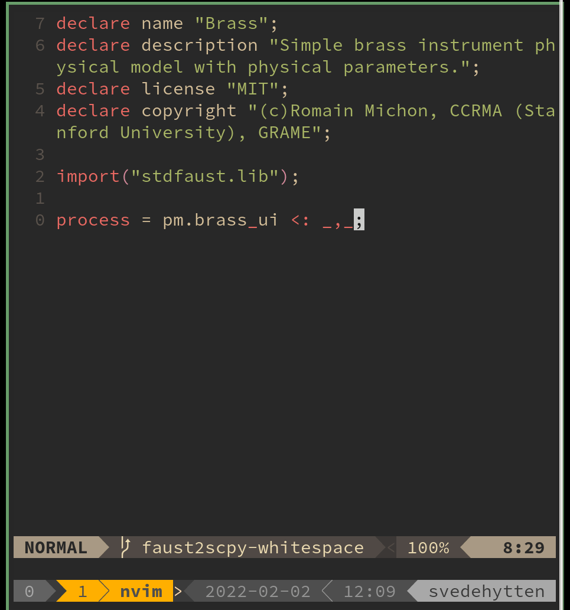
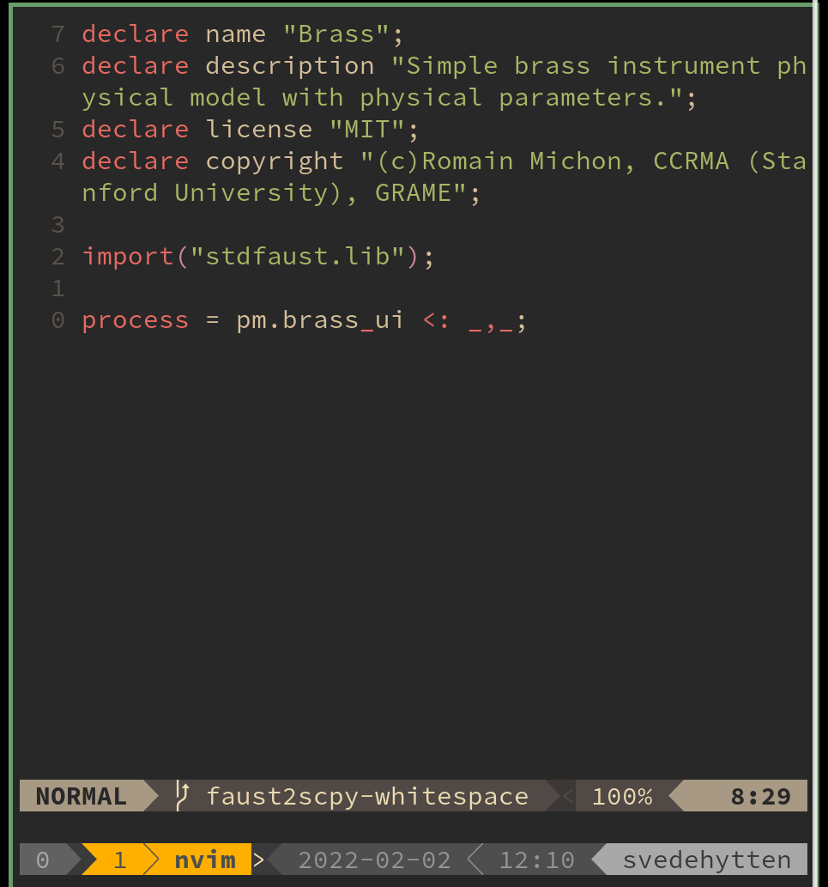

# Features

 

 

- Commands for compiling and installing as SuperCollder UGens, to Teensy and others
- Fuzzy find examples
- Faust documentation is available as native vim documentation after runnning `:FaustGenerateHelp`. Then you can for example run `:h delays.lib.`
- Commands for looking up docs on the web
- Correct comment string for faust filetype
- Faust snippets (snippets.nvim format)
- Other small handdy bits and pieces

# Requirements
- MacOS or linux system
- Nvim >= v0.5
- faust
- [nvim-fzf](https://github.com/vijaymarupudi/nvim-fzf)

# installation
Using vim-plug

```
" faust syntax and filetype
Plug 'gmoe/vim-faust'

" Other faust things
Plug 'madskjeldgaard/faust-nvim'
```

Using packer.nvim
```lua
use {
    'madskjeldgaard/faust-nvim',
        ft = "faust", -- only load plugin on .dsp files
		-- run = require'faust-nvim'.post_install, -- Generate documentation etc (currently doesn't work it seems)
        config = function()
            require 'faust-nvim'.setup()
        end,
        requires = {
			'gmoe/vim-faust',
			'vijaymarupudi/nvim-fzf'
		}
}
```

# Setup

call the .setup function via lua:
```lua
require 'faust-nvim'.setup()
```

And then if you want to use the snippets with snippets.nvim, import the snippets to your global snippets-table:

```lua
require'snippets'.snippets["faust"] = require'faust-nvim/snippets'
```

# The Faust2 command

The plugin comes with the `:Faust2` command which will compile the file that you are in using any of the faust2appl-scripts.

You can either run `:Faust2` to get a fuzzy finder selection of the different choices and execute the chosen one, or you can autocomplete the command by writing. For example by just typing `s` and hitting tab: `:Faust2 s<tab>`. Lastly, you can invoke the directly like so: `Faust2 puredata`.

Additionally, anything after the chosen script's name is added to the invocation of the command as additional flags and arguments behind the scenes. For example, to compile SuperCollider UGen's with the `-s` (for SuperNova) option: `:Faust2 sc.py -s`.
